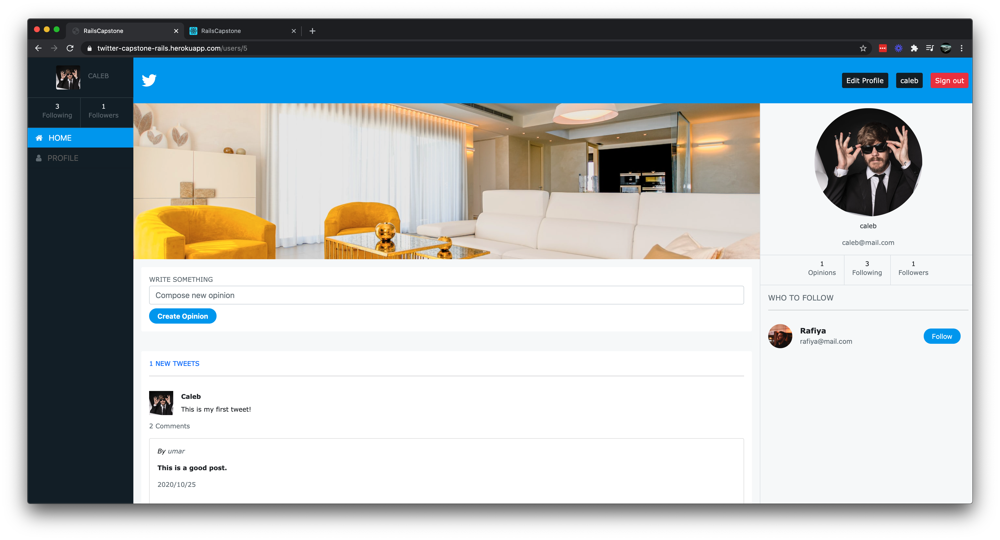

# Twitter

> Twitter Redesign/Clone with Ruby on Rails. This project is an attempt to clone all the features from Twitter, like tweeting, comments, following. Users can also upload profile image and cover photo. The design is based on a designer's personal take on Twitter UI.



## Built With

- Ruby v2.7.1
- Ruby on Rails
- Bootstrap
- RSpec
- Sass

## Features

* A User can login/signup.
* A User can see homepage.
* A User can see the other users.
* A User can follow users.
* A User can create and post opinions.
* A User can see others opinions.
* A User can **comment** on other users' opinions.
* A User can go to profile page.
* A User can see profile details.
* A User can upload profile and cover images.

## Live Demo

- [Live link](https://twitter-capstone-rails.herokuapp.com/)

## Getting Started

To get a local copy up and running follow these simple example steps.

### Prerequisites

- Ruby: 2.7.1
- Rails: 5.2.4
- Postgres: >=9.5

### Clone the Project

* To clone the project, run `git clone https://github.com/mohammadumar28/twitter-clone-rails.git`

### Setup

Install gems with:

```
bundle install
```

Setup database with:

```
   rails db:create
   rails db:migrate
```

### Usage

Start server with:

```
    rails server
```

Open `http://localhost:3000/` in your browser.

### Run tests

* To run tests:

```
    bundle exec rpsec
```

## Authors

**Muhammad Umar**
- Github: [@mohammadumar28](https://github.com/mohammadumar28)
- LinkedIn: [Mohammad Umar](https://www.linkedin.com/in/mohammadumar28/)
- Twitter: [@Mohammadumar28](https://twitter.com/Mohammadumar28)
- Email: [mohammadumar28@gmail.com](mailto:mohammadumar28@gmail.com)

## Acknowledgements

* [Gregoire Vella on Behance](https://www.behance.net/gallery/14286087/Twitter-Redesign-of-UI-details)
* [Microverse](https://microverse.org)

## Contribution

* Fork this repo.
* Create your feature branch `git checkout -b my-new-feature`.
* Commit your changes `git commit -am "Add some feature"`.
* Push to the branch `git push origin my-new-feature`.
* Create a new Pull Request.
